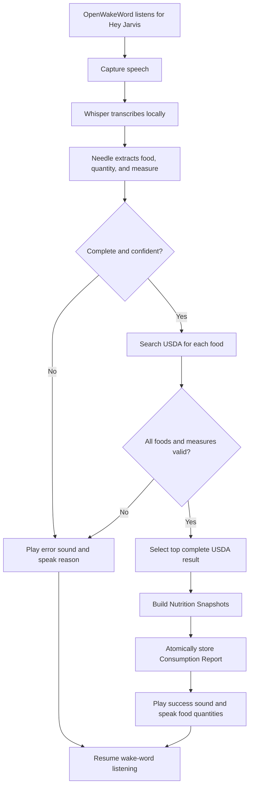

# Snack-GPT System Architecture

## Purpose

Snack-GPT is a local, single-person food logger. It records consumption through voice or a local web interface and displays descriptive weekly nutrition totals. It does not set targets, recommend foods, or provide nutrition coaching.

## Requirements

1. Run locally except for USDA FoodData Central searches.
2. Track calories, protein, carbohydrates, and fat by Monday-through-Sunday calendar week.
3. Provide a local web interface for history, corrections, deletion, import, export, and system status.
4. Work across supported desktop platforms, with Raspberry Pi OS 64-bit on a Raspberry Pi 3B+ as the deployment acceptance platform.
5. Retain no audio, transcript, or food-search cache.

## Technology

- **Coordinator and web server:** Python, server-rendered HTML, and small progressive enhancements
- **Wake word:** [OpenWakeWord](https://github.com/dscripka/openWakeWord), initially using "Hey Jarvis"
- **Speech recognition:** [Whisper](https://huggingface.co/openai/whisper-tiny) `tiny.en` through [whisper.cpp](https://github.com/ggml-org/whisper.cpp)
- **Structured extraction:** [Needle](https://github.com/cactus-compute/needle)
- **Speech feedback:** [Piper](https://github.com/OHF-Voice/piper1-gpl)
- **Food search:** [USDA FoodData Central](https://fdc.nal.usda.gov/api-guide)
- **Persistence:** SQLite

Native inference tools sit behind application-owned adapters so platform-specific binaries and audio APIs do not leak into the domain or web layers.

## Domain Model

A **Consumption Report** is one voice or web submission containing one or more **Consumption Events** for a single calendar day. Reports are atomic: every event is stored or none are.

A Consumption Event contains:

- A stable event ID and revision
- The local calendar day
- The selected USDA food identifier and description
- The consumed quantity in grams or a USDA-recognized measure
- A Nutrition Snapshot containing calories, protein, carbohydrates, and fat for the consumed quantity

Voice-created events always use the local day on which speech capture began. Repeated foods remain separate events. Events are retained until explicitly deleted and may be corrected through the web UI.

Weekly Nutrition Totals are derived from snapshots for events dated Monday through Sunday in the operating system's current local timezone. Calories display as whole numbers; protein, carbohydrates, and fat display to one decimal place.

## Voice Pipeline

Wake detection pauses while a report is processed. Transcription, extraction, lookup, and feedback run sequentially to limit contention on the Raspberry Pi. An utterance ID makes report creation idempotent.

Recording ends after approximately one second of silence and has a hard 15-second capture limit. Missing quantities, unsupported measures, low extraction confidence, unusable speech, incomplete USDA nutrition, lookup failure, or a 30-second processing timeout prevent the entire report from being created. There is no pre-save confirmation.

Only parsed food search terms leave the machine. USDA results are not cached as a reusable food catalog, but each recorded event keeps the selected description and Nutrition Snapshot so history remains stable and available offline.

## Web Interface

The web UI opens on the current week and provides previous-week navigation, daily events, and Weekly Nutrition Totals. It supports:

- Creating validated Consumption Events
- Replacing the silently selected USDA food with another search result
- Editing food, quantity, or day, and deleting with confirmation
- Pausing or resuming microphone listening
- Idempotent JSON export and import using stable event IDs
- Viewing listening, paused, processing, USDA unavailable, audio unavailable, and configuration-error states

Changing food or quantity performs a fresh USDA lookup and atomically replaces the Nutrition Snapshot. Changing only the day does not. A failed correction leaves the original event unchanged. Dates may be today or in the past, never the future. Revision checks reject stale concurrent edits.

The UI remains usable offline for history, totals, date corrections, deletion, export, and import. Creation and food or quantity corrections require USDA.

## Persistence

SQLite stores events, nutrition snapshots, revisions, processed utterance IDs, and schema versions. Writes for a Consumption Report occur in one transaction. Import skips existing identical IDs and reports conflicts without overwriting local events.

The USDA API key comes from an environment variable and is never stored in SQLite or sent to the browser. The owner password is initialized or reset by a local CLI command; only its password hash is stored.

## Privacy and Networking

- Audio and transcripts exist only in memory for the duration of processing.
- Normal logs contain IDs, pipeline stages, timings, and sanitized failures, not transcripts or food names.
- Food names may appear only in explicitly enabled debug logs.
- The web server defaults to `127.0.0.1`; LAN binding requires explicit configuration.
- LAN access requires the owner password and a secure session cookie.
- The initial trusted-LAN release uses HTTP. HTTPS or remote access belongs behind an owner-managed reverse proxy or VPN.

## Platform and Deployment

The application supports Linux ARM64 and x86-64, macOS ARM64 and x86-64, and Windows x86-64. Raspberry Pi deployment uses 64-bit Raspberry Pi OS Lite and a native `systemd` service rather than a container, avoiding container audio-device complexity. The service is installed disabled and may be enabled after microphone and speaker setup succeeds.

Audio uses the configured system-default microphone and speaker, with environment-variable overrides. Models and platform binaries are provisioned during setup and then run locally.

On the Raspberry Pi 3B+, successful processing should usually finish within 15 seconds after speech ends and must fail cleanly by 30 seconds. The stack is accepted only after an on-device benchmark verifies memory use, transcription quality, latency, wake-word reliability, and audio-device behavior.

## Licensing

The initial release is personal and non-commercial. Distribution must account for Piper's GPL-3.0 license, the licenses of selected Piper voices, and the CC BY-NC-SA license of OpenWakeWord's bundled models.