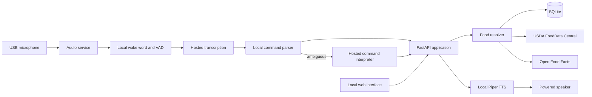

# Snack GPT Implementation Plan

## Product boundary

Snack GPT is a local-first wellness food logger for a Raspberry Pi 3B. Voice is the fast path; an authenticated local web interface supports review, correction, configuration, and unresolved entries.

The first release does not provide meal labels, medical advice, inventory, meal planning, timers, automatic software updates, or required cloud accounts. It supports one default profile while allowing additional explicit profiles later.

## Core journey

1. The Pi detects a wake phrase locally and indicates that recording has started.
2. Voice activity detection ends the recording locally.
3. A hosted service transcribes the activated audio.
4. A local parser handles common commands; a hosted language model interprets ambiguous language into a validated command.
5. The application resolves each food from aliases, cache, or nutrition sources.
6. Deterministic local code converts quantities and calculates nutrition.
7. SQLite commits the result before the assistant acknowledges success.
8. Local text-to-speech reports confirmed and pending items separately.

Preparing food creates a Meal Draft. Statements such as "I ate 200 grams of chicken" create Consumption Entries immediately. A Meal Draft becomes consumed only through an explicit command, and its nutrition may be distributed by final cooked weight or serving yield.

## Architecture



Run two long-lived `systemd` services:

- **Audio service**: wake-word detection, recording, voice activity detection, API calls, and speech playback.
- **Application service**: FastAPI domain operations, provider integrations, and server-rendered web pages.

SQLite provides durable command queuing and coordination. Do not add Docker, Redis, a message broker, a reverse proxy, or a continuously running Node.js process initially.

## Recommended stack

| Concern | Recommendation |
| --- | --- |
| Hardware | Raspberry Pi 3B, high-endurance SD card, class-compliant USB microphone, powered speaker, recording LED, physical microphone mute |
| OS | Raspberry Pi OS Lite 64-bit |
| Language | Python 3.11 or the version supplied by the selected Raspberry Pi OS release |
| Web/API | FastAPI, Jinja2 templates, and lightweight progressive enhancement such as HTMX |
| Persistence | SQLite in WAL mode with SQLAlchemy and Alembic |
| HTTP | `httpx` with bounded timeouts and retries |
| Wake word | `openWakeWord`, using a proven bundled phrase before attempting a custom model |
| Voice activity | WebRTC VAD |
| Speech output | Piper with a compact local voice and pre-generated common acknowledgements |
| External AI | One hosted provider initially, behind separate transcription and command-interpreter interfaces |
| Nutrition | USDA FoodData Central for generic US foods; Open Food Facts for barcode-identified packaged foods |
| Process management | Native `systemd` units |
| Tests | `pytest`, provider contract tests, and recorded command fixtures |

Use a hosted transcription API and a small model that supports schema-constrained output. Model identifiers remain configuration rather than domain logic so they can change without migrations. The language model may parse or explain a command, but it may not invent nutrition values or calculate totals.

## Domain rules

- Values take precedence in this order: profile-defined food, exact package label, authoritative generic database, secondary public database.
- A Food Alias is durable only after explicit profile approval. Recent selections may rank results but do not silently redefine generic phrases.
- Missing quantities require clarification unless the profile saved an explicit default portion.
- Volume converts to weight only through a food-specific portion or density.
- Raw and cooked foods are distinct when the difference materially affects nutrition.
- Historical Consumption Entries retain nutrition snapshots even when their Food Reference changes.
- Daily Targets are effective-dated and evaluated in the profile's timezone at the explicit consumption time.
- Confirmed Totals exclude Pending Consumption and are marked incomplete while pending items exist.
- Corrections replace or reverse entries without erasing history.
- Voice can undo the latest operation, but permanent deletion requires authenticated web confirmation.
- Each captured command has an idempotency key to prevent retries from creating duplicate entries.

## Food resolution

Resolve food in this order:

1. Exact profile-approved alias or barcode
2. Exact cached Food Reference
3. Recent matching selection as a ranking signal
4. Fuzzy local search
5. USDA FoodData Central lookup
6. Open Food Facts lookup
7. User clarification or Pending Consumption

Ask for clarification when plausible matches materially change totals. A delayed lookup may automatically confirm only an exact approved alias or barcode; other matches require approval.

## Persistence model

Start with these records:

- `profiles`: name, timezone, and active/default state
- `daily_targets`: effective date and calorie, protein, carbohydrate, fat, and fiber targets
- `food_references`: canonical identity, preparation, brand, barcode, provenance, and normalized nutrients
- `food_aliases`: profile-approved phrase or barcode mapped to a Food Reference
- `portions`: food-specific unit, amount, and gram equivalent
- `meal_drafts`: draft identity, ingredients, and optional final yield
- `consumption_entries`: profile, consumed time, quantity, nutrient snapshot, and correction linkage
- `pending_consumption`: original description, quantity, time, profile, and resolution state
- `commands`: idempotency key, transcript, status, item outcomes, and timestamps
- `provider_cache`: source key, normalized result, original response, and retrieval metadata

Store provider payloads for provenance but do not retain raw audio by default. Retain command text briefly for troubleshooting with an opt-out. Nutrition history remains until explicitly deleted.

## Raspberry Pi constraints

- Keep the two services within the Pi 3B's 1 GB RAM ceiling.
- Pre-generate common speech and keep dynamic responses short.
- Bound all queues, logs, cache growth, request concurrency, and retry counts.
- Avoid local speech transcription and general-purpose language models.
- Keep web pages server-rendered and usable without a large client bundle.
- Target acknowledgement within two seconds for cached commands and five seconds for external lookups; announce longer lookups immediately.
- Cached aliases, calculations, history, corrections, and manual entry must work offline.
- Without connectivity, support a constrained local grammar for known aliases and queue unresolved external work.

## Security and reliability

- Process microphone audio locally until the wake phrase activates.
- Show a recording indicator and support a physical mute control.
- Keep credentials outside the repository in a restricted environment file.
- Require an initial admin password and authenticated web sessions, including on the LAN.
- Bind to the LAN only by default and use secure cookie settings appropriate to the deployment.
- Use transactional writes and acknowledge success only after commit.
- Back up SQLite automatically with retention suitable for the SD card.
- Export complete history and custom foods as JSON and CSV.
- Start both services after reboot and expose a lightweight health endpoint.

## Deployment

The personal deployment workflow is intentionally simple:

```sh
git pull
./scripts/setup.sh
```

The setup script must be idempotent: create or update the virtual environment, install locked dependencies, apply database migrations, install or refresh `systemd` units, and restart both services. Automatic update and version rollback systems are out of scope.

## Delivery phases

### Phase 1: Deterministic core

- Implement domain records, migrations, unit conversion, nutrition arithmetic, and idempotent command handling.
- Integrate USDA and Open Food Facts behind provider interfaces.
- Build text-based command fixtures before voice integration.
- Validate ten frequently used foods, including raw/cooked and volume/weight cases.

### Phase 2: Review interface

- Add authenticated server-rendered views for daily totals, history, corrections, aliases, targets, pending items, and manual entry.
- Add JSON/CSV export and verified SQLite backup.

### Phase 3: Voice loop

- Add local wake-word detection, VAD, recording indication, hosted transcription, constrained command parsing, schema-validated LLM fallback, and Piper responses.
- Implement clarification, undo, partial resolution, and offline queuing.

### Phase 4: Pi appliance

- Add `systemd` units and the idempotent setup script.
- Measure idle and peak memory, cached and uncached latency, SD-card writes, reboot recovery, and disconnected behavior on the Pi 3B.

## MVP acceptance criteria

- A spoken command containing multiple foods can produce confirmed and pending outcomes without losing either.
- Cached known foods receive a spoken acknowledgement within the target latency on the Pi 3B.
- Replaying or retrying one command cannot duplicate Consumption Entries.
- Nutrition totals are calculated locally from stored source values and quantity conversions.
- Historical totals do not change after a Food Reference or Daily Target is updated.
- Power loss cannot produce a spoken success for an uncommitted entry.
- Internet loss preserves manual operation and clearly identifies queued or pending voice work.
- The local web interface can inspect, correct, undo, export, and permanently delete data with appropriate confirmation.
- `git pull && ./scripts/setup.sh` brings an already configured Pi to the current application version.